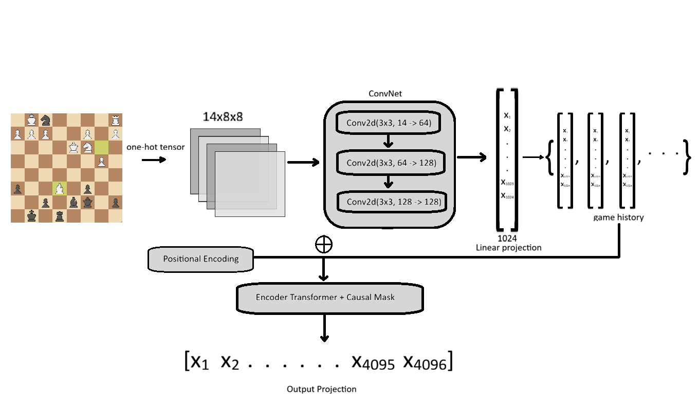

# ♟️ The Engine: Hybrid CNN-Transformer Chess Engine

An 88-million parameter custom neural chess engine. 

This engine uses a **Convolutional Neural Network (CNN)** to extract spatial features from the board, which are then projected into a **Transformer Encoder** to predict the next move based on the game's sequence history.

## 🧠 Architecture Overview

<p align="center"></p>

* **CNN:** The engine receives the board as a one-hot encoded spatial tensor ([14, 8, 8] representing piece positions, turns, castling rights and en passant). A stack of convolutional layers processes this grid to detect localized information such as pinned pieces, pawn chains, or king safety, outputting a dense feature map of the current board state.
* **Linear Projection:** The CNN's output is flattened and passed through a linear projection layer. This translates the board state into a 1024-dimensional embedding token, formatted for the Transformer's LayerNorm.
* **Transformer:** The board tokens are stacked into a sequence representing the game history up to the max sequence length. Multi-headed self-attention allows the model to weigh historical context (e.g., remembering a trapped piece from 10 moves ago) to evaluate the current position. This is projected onto 4096 move options, masked to consider only legal moves, and greedily decoded for the final prediction.

## 🚀 Getting Started

### 1. Install Dependencies

```bash
git clone https://github.com/rahultole06/chess-engine.git
cd chess-engine
pip install -r requirements.txt
```

### 2. Download Model Weights

- Go to [Releases](https://github.com/rahultole06/chess-engine/releases)
- Download ```knowledge.pth```
- Create a ```checkpoints``` folder in ```chess-engine```
- Place the file inside

### 3. How to use (The UCI Protocol)

The engine communicates using **UCI (Universal Chess Interface)**. If you are new to chess programming, UCI is the industry-standard text protocol that allows graphical interfaces (Like Lichess) to talk to chess engines. 

What this means is that you don't have to play the engine in terminal, you can plug it into a chess GUI.

**Method A: Playing manually in the terminal/IDE**

Run ```runner.py``` in an IDE, or directly in on command line:
```
python -u runner.py
```
Once the script is running, it will wait for you to type commands. You act as the GUI by sending these exact strings:

- Enter ```uci```, the engine will introduce itself and print ```uciok```.

- Enter ```isready```. Wait for the engine to load the model into memory. It will print readyok when finished.

- Enter the current board state: Eg. ```position startpos moves e2e4 e7e5```

- Enter ```go```. The model will run a forward pass and print ```bestmove [move]```

**Method B: Playing in a GUI**

Simply add the engine to your GUI. This will vary based on which GUI you prefer to use, consult their documentation for help. 
* *Note:* Ensure you pass the `-u` (unbuffered) flag to Python in your engine configuration (`python -u runner.py`).

## 📊 Current Evaluation

Rating: ~600 Elo (Calculated via Ordo BayesElo by playing Stockfish Level 0)

## 🛢️ Dataset Used

A dataset of ~1 million games from the [Lichess Open Database](https://database.lichess.org/) (From 2014 - July) was used to train this model.

## 🗺️ Roadmap
[x] Supervised Learning from Dataset

[x] UCI Protocol Integration

[ ] GRPO Reinforcement Learning (Optimizing against a Stockfish-driven reward function)
